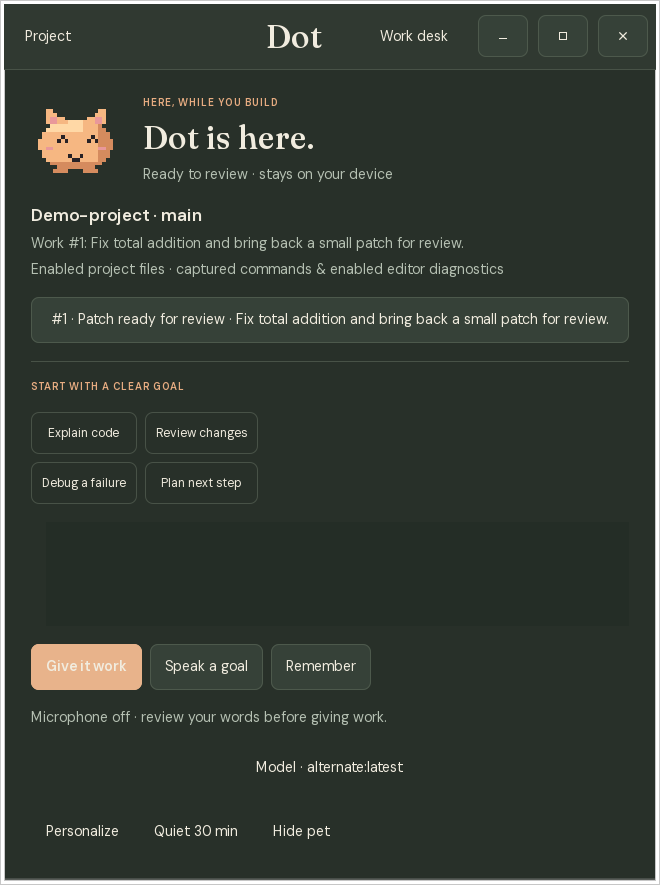

# Dev Companion — local developer workflow preview

Dev Companion keeps a small, private work desk for an opted-in Git project. It can
stay available after chat closes, notice a real terminal failure or an enabled
VS Code diagnostic, and keep that incident with its source evidence. With a separate opt-in, the local model investigates new failures while chat is
closed. Related source and reported locations accompany a tentative cause. You
can request a small correction for review. Reminders and
focus breaks remain available between conversations. The pet and companion name
are optional ways to make it feel familiar; the same local work ledger carries the context.

**v0.8.0 workflow preview for Linux x86_64.** This repository contains public
launch assets, feedback templates and binary releases. The application source
is currently private.

- [Download, checksums and release notes](https://github.com/ashuujha/devcompanion-launch/releases/tag/v0.8.0)
- [Setup, update and privacy guide](https://ashuujha.github.io/devcompanion-launch/guide.html)
- [Recorded v0.5 local-model workflow](https://ashuujha.github.io/devcompanion-launch/demo.txt)
- [Join the first developer trials](https://github.com/ashuujha/devcompanion-launch/issues/1)
- [First-session feedback](https://github.com/ashuujha/devcompanion-launch/issues/new/choose)

## A desktop place for ongoing work

The native Linux dot, quick panel and graphical work
desk to the existing engine. Give it project work, dismiss the panel, then review
the actual source ranges, model report and proposed diff. Application and named
checks require separate approvals. The same goals, task IDs and outcomes remain
available in the CLI. Source-analysis requests need real reads; explicit
analysis-only tasks reject edits. Version 0.8 adds a calmer forest work desk,
original pixel companions, starter prompts, a local model picker, a hide control,
and an optional push-to-talk shortcut. Larger-project model accuracy remains unproven.

```sh
# After binary/local-model setup, in your chosen Git project:
dot desktop check
dot desktop
# Optional launcher and graphical login presence:
dot desktop install --login
```

[Desktop setup and limits](https://ashuujha.github.io/devcompanion-launch/guide.html#desktop)
include the optional system GTK/Python dependencies. GNOME/XWayland was tested;
other window managers may handle placement differently. Speak a goal uses local
recognition and puts words into the composer for review. Hold Ctrl+Alt+Space while
the companion has focus, then release to finish; Esc cancels. Personalize offers
an optional session shortcut through the desktop permission dialog. Hide pet
removes its visible character and the panel can show it again. The model picker
lists downloaded local completion models; switching does not rewrite existing
tasks. Physical voice and global shortcut comfort still need people to try them.



The picture is an actual v0.8 GTK interface with a controlled model; it demonstrates
the review workflow, not inference quality. A real local-model evaluation on the
larger Offline-GPT repository retained an incorrect test interpretation and
ended with an explicitly unverified result. Independent everyday usefulness
and retention remain unmeasured.

## Start with a real project

Verify and install the [Linux archive](https://github.com/ashuujha/devcompanion-launch/releases/download/v0.8.0/devcompanion-0.8.0-linux-x86_64.tar.gz)
using the guide. Ollama and a downloaded local model are needed for conversation
and proposed corrections; reminders and incident recording work without inference. Background model
investigation requires `proactive enable`. In an existing Git repository:

```sh
dot setup --check
dot setup --yes --presence --proactive --goal "Finish the current bug fix"
dot shell                  # opt-in Bash session; captures commands typed here
```

`dot` opens the work desk and conversation. `dot desk` shows open incidents,
reminders and recent activity without starting a chat. Start `dot shell` only
for terminal work you want recorded. It leaves ordinary terminal commands under
your control; it does not run suggested commands. `dot presence disable` stops
background observation for this project; `dot presence uninstall` removes the
login service. Both require your explicit action.

For VS Code, download the optional
[diagnostics extension](https://github.com/ashuujha/devcompanion-launch/releases/download/v0.8.0/dot-developer-companion-0.1.0.vsix),
install it with `code --install-extension dot-developer-companion-0.1.0.vsix`,
trust the workspace and run **Dot: Enable Editor Diagnostics for Workspace**.
The editor must be open to supply diagnostics. The extension sends bounded
messages, file paths and line numbers for the enabled Git project, not source
buffers. Disable it from the command palette when you want it to stop.

## Follow a problem

- `dot proactive enable` permits background investigation in this project. New
  saved editor errors and captured failures are explained with no open chat.
  `dot proactive list` and `dot proactive show ID` separate observed evidence,
  hypothesis and next step; code changes make old answers historical.
- New editor evidence settles for four seconds. Investigation has a 90-second
  default project cooldown, one worker, a 512-token reply cap and no automatic
  commands or edits. `dot quiet 30` pauses it; `dot proactive disable` stops it.
- `dot desk` or `/incidents` shows the evidence. `/incident ID` shows a specific
  error, its original location and later status.
- `/fix ID` asks the downloaded local model to prepare a small correction. Read
  the task report and diff with `/review ID`; `/apply ID` is a separate approval.
- Register and run a relevant named check explicitly, for example
  `dot check add tests -- npm test` and `dot verify tests`. A successful check
  for the current code is distinct from an editor diagnostic disappearing or an
  old passing result. A correction itself does not prove recovery.
- `/remind 20m Check the migration`, `dot remind snooze ID --in 10m`, and
  `dot remind done ID` keep small commitments visible. `/focus 25` schedules
  one break reminder; `/quiet 30` pauses desktop interruptions.

## Catch secrets before publishing

In the Git project you want to protect:

```sh
dot guard setup             # one pinned, checksum-verified detector download
dot guard check             # working-tree text and essential hygiene
dot guard enable            # install local commit/push protection
```

`dot guard scan --staged` checks full changed files from Git's index, including
secrets absent from the working copy. Pushes inspect outgoing commit history,
including a secret removed before a new branch is published. Existing hooks
keep their arguments, input and exit status. Reports withhold secret values.
Missing tools, invalid reports and exceeded limits stop guarded operations.
`dot guard status` shows readiness; `dot guard disable` restores the earlier
hooks setting. `dot secure` and `devcompanion guard` also work.

Checks run locally without Ollama or internet after setup. They cover known
credential patterns, tracked environment files and a small set of warnings.
They can have false positives and miss unknown secrets; local hooks can be
bypassed. This is essential hygiene, not a full security audit or hosted GitHub
configuration. If a credential was already published, revoke it at its provider.

## Keep a voice conversation open

`dot voice setup` downloads the optional English Whisper/Piper runtime once.
In an initialized Git project:

```sh
dot voice chat               # Enter starts each follow-up
dot voice chat --continuous  # listen again between replies
```

Inside chat, use `/voice` or `/voice continuous`. Recording stops during
transcription, reasoning and playback. Silence skips model requests. Press
`q` then Enter, press Ctrl+C, or say exactly “exit voice” to leave voice mode.
`dot voice ask --once` keeps the single-turn option. The microphone is off
outside explicitly opened voice mode. This is turn-based speech, without a
wake word or interruption during playback. Controlled two-turn, silence and
microphone cleanup tests passed; physical microphone and room comfort need
hands-on validation.

## Evidence and limits

The [recorded v0.5 fixture](https://ashuujha.github.io/devcompanion-launch/demo.txt)
uses a multi-file Python billing project and nine unchanged tests. With chat
closed, a new failing named check triggered a real local-model explanation.
The maker then requested and reviewed a correction before applying it and
rerunning the suite. This is a scripted maker evaluation, not an external
user trial or a general coding-quality benchmark. It was not network-isolated. A separate Flask 3.1.2 evaluation found wrong
model patches and an omitted empty-string case. Review and unchanged tests
exposed those mistakes; general debugging reliability remains unproven.

Python tracebacks/unittest/pytest, Node/TypeScript frames, Go positions, Rust
compiler diagnostics and ESLint JSON/stylish output have format coverage.
Bounded source context follows simple local imports; unsupported output keeps
its original excerpt. Small models can still be wrong. Patches remain limited
to three small files, and only a current relevant check establishes verification.

Initial runtime/model/voice downloads and the explicit updater need internet.
Inference stays on loopback with no cloud fallback or usage telemetry. The
service uses enabled adapters, not screen capture or arbitrary shell history.
VS Code diagnostics may be stale; chosen checks may use the network.

## Updates and first developer trials

From v0.5 onward, `dot update --check` inspects official releases and `dot update`
verifies the archive before atomic replacement. It preserves your local memory,
models and alias, retains one previous binary and restarts a matching managed
presence service. Pre-v0.5 installations need the one-time archive update in the
guide. Checksums verify consistency with the published release; they are not
independent signatures.

Use `dot trial start` for an explicit session, `dot trial rate ID helpful|incorrect|noisy`
for an incident, `dot proactive rate ID useful|noisy|missed` for an explanation,
and `dot trial missed --note "Short description"` for a problem it missed.
Finish with `dot trial finish helped|blocked|neutral`. `dot trial report --json`
contains aggregate counts without code, paths, identity or private notes.
Nothing uploads automatically. Share only what you choose through
[first-session feedback](https://github.com/ashuujha/devcompanion-launch/issues/new/choose).

The archive contains a static CLI, MIT application license, dependency notices
and quickstart. It contains no application source, model weights or private logs.
